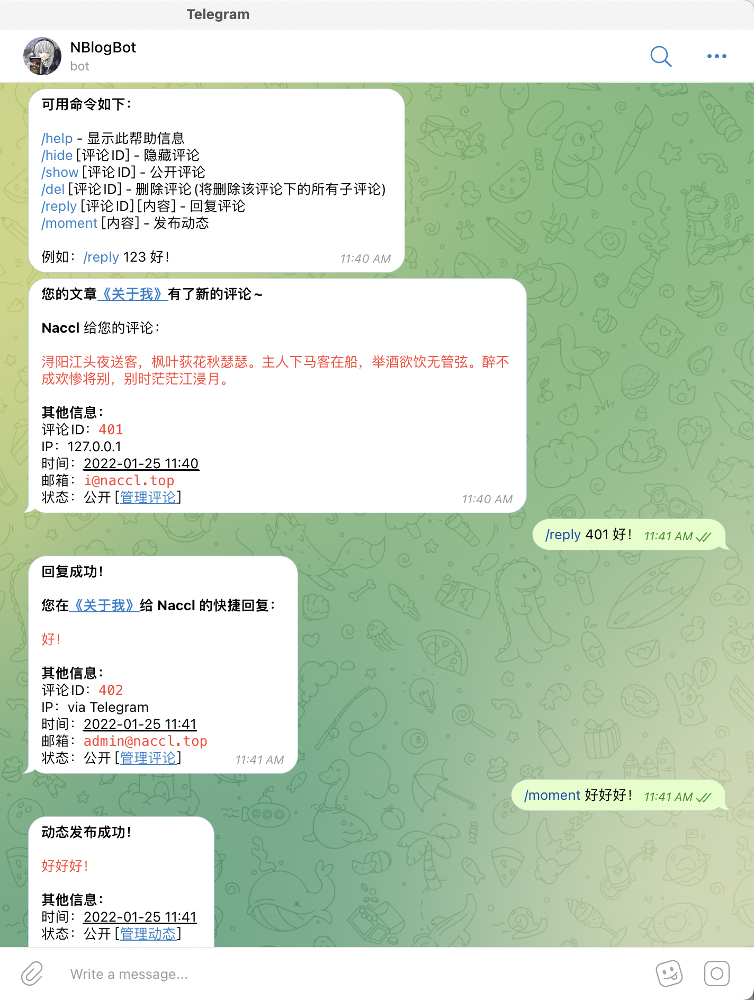
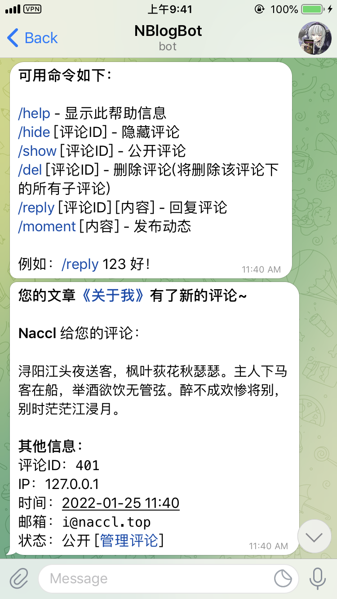
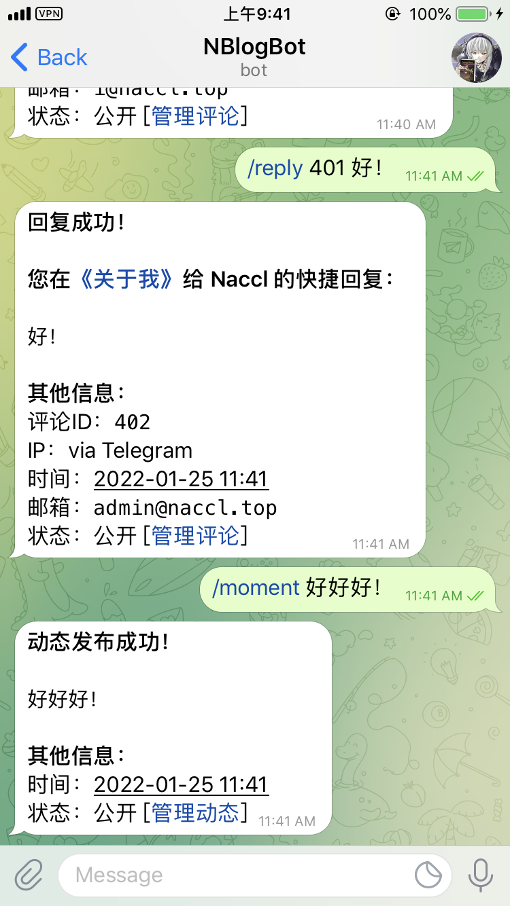

	

	
	
	
	
	
	

## 简介

Spring Boot + Vue「前后端分离，人不分离」博客系统

自用博客，长期维护，欢迎勘误

预览地址：

前台：[http://xingling.fun](http://xingling.fun)

## 后端

1. 核心框架：[Spring Boot](https://github.com/spring-projects/spring-boot)
2. 安全框架：[Spring Security](https://github.com/spring-projects/spring-security)
3. Token：[jjwt](https://github.com/jwtk/jjwt)
4. ORM 框架：[MyBatis](https://github.com/mybatis/spring-boot-starter)
5. 分页插件：[PageHelper](https://github.com/pagehelper/Mybatis-PageHelper)
6. NoSQL 缓存：[Redis](https://github.com/redis/redis)
7. Markdown 转 HTML：[commonmark-java](https://github.com/commonmark/commonmark-java)
8. 离线 IP 地址库：[ip2region](https://github.com/lionsoul2014/ip2region)
9. 定时任务：[quartz](https://github.com/quartz-scheduler/quartz)
10. UserAgent 解析：[yauaa](https://github.com/nielsbasjes/yauaa)

邮件模板参考自 [Typecho-CommentToMail-Template](https://github.com/MisakaTAT/Typecho-CommentToMail-Template)

## 前端

核心框架：Vue2.x、Vue Router、Vuex

Vue 项目基于 @vue/cli4.x 构建

JS 依赖及参考的 css：[axios](https://github.com/axios/axios)、[moment](https://github.com/moment/moment)、[nprogress](https://github.com/rstacruz/nprogress)、[v-viewer](https://github.com/fengyuanchen/viewerjs)、[prismjs](https://github.com/PrismJS/prism)、[APlayer](https://github.com/DIYgod/APlayer)、[MetingJS](https://github.com/metowolf/MetingJS)、[lodash](https://github.com/lodash/lodash)、[mavonEditor](https://github.com/hinesboy/mavonEditor)、[echarts](https://github.com/apache/echarts)、[tocbot](https://github.com/tscanlin/tocbot)、[iCSS](https://github.com/chokcoco/iCSS)

**由 [@willWang8023](https://github.com/willWang8023) 维护的 Vue3 版本请查看 [blog-view-vue3](https://github.com/willWang8023/blog-view-vue3)**

### 后台 UI

后台基于 [vue-admin-template](https://github.com/PanJiaChen/vue-admin-template) 二次修改后的 [my-vue-admin-template](https://github.com/Naccl/my-vue-admin-template) 模板进行开发（[于2021年11月1日重构](https://github.com/Naccl/NBlog/commit/b33641fe34b2bed34e8237bacf67146cd64be4cf)）

UI 框架为 [Element UI](https://github.com/ElemeFE/element)

### 前台 UI

[Semantic UI](https://semantic-ui.com/)：主要使用，页面布局样式，个人感觉挺好看的 UI 框架，比较适合前台界面的开发，语义化的 css，前一版博客系统使用过，可惜该框架 Vue 版的开发完成度不高，见 [Semantic UI Vue](https://semantic-ui-vue.github.io/#/)

[Element UI](https://github.com/ElemeFE/element)：部分使用，一些小组件，弥补了 Semantic UI 的不足，便于快速实现效果

文章排版：基于 [typo.css](https://github.com/sofish/typo.css) 修改

## Telegram Bot 快捷操作

| 桌面                                                         | Phone                                                        | Phone                                                        |
| ------------------------------------------------------------ | ------------------------------------------------------------ | ------------------------------------------------------------ |
|  |  |  |

若要启用该功能，参考以下步骤：

1. 向 @BotFather 申请一个 Bot，得到该 Bot 的`token`，格式如`1234567890:qwertyuiopasdfghjklzxcvbnm`
2. 与该 Bot 私聊，随便发个消息，然后打开此链接`https://api.telegram.org/bot<botToken>/getUpdates`（替换链接中的 token），在`result -> message -> chat -> id`得到`chatId`
3. 将获取的`token`和`chatId`填入`application-dev.properties`，并启用`comment.notify.channel=tg`
4. 由于目前仅提供 webhook 的方式获取消息更新，所以`application-dev.properties`中的`blog.api`需要填写后端 API 的地址，并且**必须是`https`(Telegram 的要求)**，也就是说如果你没有公网 IP 或内网穿透或反向代理，那么在本地环境是无法测试的，建议直接扔服务器上
5. 国内通常情况下无法访问 TG 的 API，因此提供了两种方式
   1. 正向代理：配置`http.proxy.server`，通过你的代理发送请求
   2. 反向代理：可以直接使用我跑在 Cloudflare Workers 上的反代，默认配置即可。示例代码已放在`blog-api/cfworker-tg-api-open.js`，可自行搭建（**22.05.12 更新，近两天大陆绝大多数地区 `*.workers.dev` 域名已被墙，因此若仍想使用此反代方式访问 cf worker，需要将 Worker 绑定路由至自己的域名，详见[相关讨论](https://github.com/XIU2/CloudflareSpeedTest/issues/205)**）

## 开发环境

1. 创建 MySQL 数据库`nblog`，并执行`/blog-api/nblog.sql`初始化表数据
2. 修改配置信息`/blog-api/src/main/resources/application-dev.properties`
3. 安装 Redis 并启动
4. 启动后端服务
5. 分别在`blog-cms`和`blog-view`目录下执行`npm install`安装依赖
6. 分别在`blog-cms`和`blog-view`目录下执行`npm run serve`启动前后台页面

## 注意事项

一些常见问题：

- MySQL 确保数据库字符集为`utf8mb4`（”站点设置“及”文章详情“等许多表字段需要`utf8mb4`格式字符集来支持 emoji 表情，否则在导入 sql 文件时，即使成功导入，也会有部分字段内容不完整，导致前端页面渲染数据时报错）
- 确保 Maven 和 NPM 能够成功导入现版本依赖，请勿升级或降低依赖版本
- 数据库中默认用户名密码为`Admin`，`123456`，因为是个人博客，没打算做修改密码的页面，可在`top.naccl.util.HashUtils`下的`main`方法手动生成密码存入数据库
- 注意修改`application-dev.properties`的配置信息
  - 注意修改`token.secretKey`，否则无法保证 token 安全性
  - `spring.mail.host`及`spring.mail.port`的默认配置为阿里云邮箱，其它邮箱服务商参考关键字`spring mail 服务器`（邮箱配置用于接收/发送评论提醒）
- 如需部署，注意将`/blog-view/src/plugins/axios.js`和`/blog-cms/src/util/request.js`中的`baseUrl`修改为你的后端 API 地址
- 大部分个性化配置可以在后台“站点设置”中修改，小部分由于考虑到首屏加载速度（如首页大图）需要修改前端源码

## 隐藏功能

- 在前台访问`/login`路径登录后，可以以博主身份（带有博主标识）回复评论，且不需要填写昵称和邮箱即可提交
- 在 Markdown 中加入`<meting-js server="netease" type="song" id="歌曲id" theme="#25CCF7"></meting-js>` （注意以正文形式添加，而不是代码片段）可以在文章中添加 [APlayer](https://github.com/DIYgod/APlayer) 音乐播放器，`netease`为网易云音乐，其它配置及具体用法参考 [MetingJS](https://github.com/metowolf/MetingJS)
- 提供了两种隐藏文字效果：在 Markdown 中使用`@@`包住文字，文字会被渲染成“黑幕”效果，鼠标悬浮在上面时才会显示；使用`%%`包住文字，文字会被“蓝色覆盖层”遮盖，只有鼠标选中状态才会反色显示。例如：`@@隐藏文字@@`，`%%隐藏文字%%`

## LICENSE

[MIT](https://github.com/Naccl/NBlog/blob/master/LICENSE)

## Thanks

感谢 [JetBrains](https://www.jetbrains.com/?from=NBlog) 提供的 Open Source License

感谢上面提到的每个开源项目

